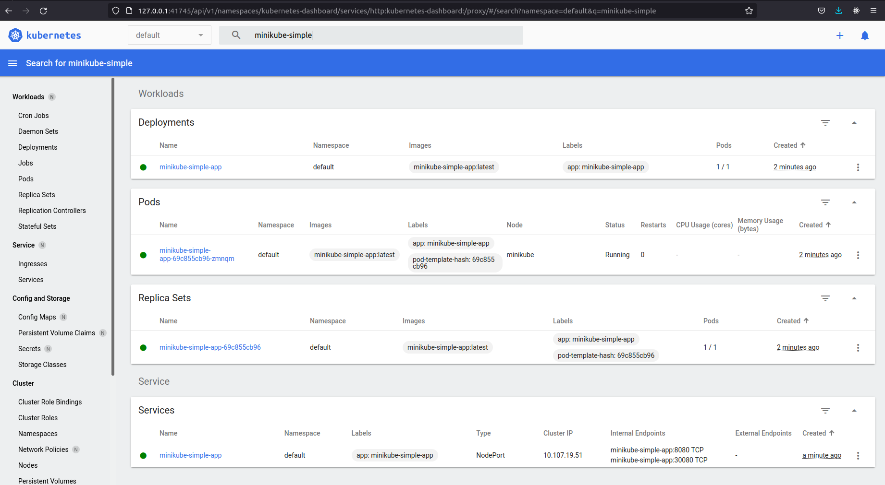
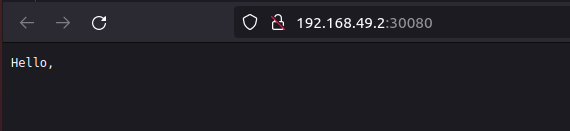

# Kubernetes-WorkStart-GUIDE

**Kubernetes** - Открытое программное обеспечение для оркестровки контейнеризированных приложений - автоматизации их развёртывания, масштабирования и координации в условиях кластера. Поддерживает основные технологии контейнеризации, включая Docker, rkt, также возможна поддержка технологий аппаратной виртуализации.

## Структура

1. [Концепции Kubernetes](#Концепции-Kubernetes)
2. [Deploy приложения в Kubernetes](#deploy-приложения-в-kubernetes-с-использованием-minikube)
    1. [Deploy простого приложения](#Развертывание-простого-приложения)
    2. [Deploy приложения состоящего из нескольких узлов](#Deploy-приложения-состоящего-из-нескольких-узлов)


## Концепции Kubernetes

Nodes: Нода это машина в кластере Kubernetes. 

Pods: Pod это группа контейнеров с общими разделами, запускаемых как единое целое.

Replication Controllers: replication controller гарантирует, что определенное количество «реплик» pod'ы будут запущены в любой момент времени.

Services: Сервис в Kubernetes это абстракция которая определяет логический объединённый набор pod и политику доступа к ним.

Volumes: Volume(раздел) это директория, возможно, с данными в ней, которая доступна в контейнере.

Labels: Label'ы это пары ключ/значение которые прикрепляются к объектам, например pod'ам. Label'ы могут быть использованы для создания и выбора наборов объектов.

Kubectl Command Line Interface: kubectl интерфейс командной строки для управления Kubernetes.

## Deploy приложения в Kubernetes с использованием Minikube
### Развертывание простого приложения

Для примера используется [простой http-server](https://github.com/DarkReduX/Kubernetes-WorkStart-GUIDE/tree/master/examples/simple-http-server) принимающий запрос GET : addres?name=Value и возвращающий ответ `Hello, <name>`

```go
package main

import (
	"fmt"
	"github.com/labstack/echo"
	"net/http"
)

func main() {
	e := echo.New()
	e.GET("/", func(c echo.Context) error {
		return c.String(http.StatusOK, fmt.Sprintf("Hello, %s", c.QueryParam("name")))
	})

	e.Logger.Fatal(e.Start(":8080"))
}
```

#### Шаг 1: создать docker image приложения

Необходимо описать инструкцию сборки образа docker. Для приложения выше использует Dockerfile: 

```dockerfile
FROM golang:1.17.4-alpine

RUN mkdir /http-server

COPY . /http-server

WORKDIR /http-server

RUN go build -o main

CMD ["/http-server/main"]

EXPOSE 8080
```

Создание образа:
```shell
docker build . -t minikube-simple-app
```

#### Шаг 2. Запуск Minikube

Необходим установленный minikube

```shell
minikube start
kubectl config set-context minikube
```

#### Шаг 3. Создание Deployment'a и Service'a в кластере Kubernetes

Deployment - Развертывание предоставляет декларативные обновления для модулей и наборов реплик.

Вы описываете желаемое состояние в развертывании, и контроллер развертывания изменяет фактическое состояние на желаемое состояние с контролируемой скоростью. Вы можете определить развертывания для создания новых наборов реплик или для удаления существующих развертываний и использования всех их ресурсов в новых развертываниях.

app-deployment.yml:
```yaml
apiVersion: apps/v1
kind: Deployment
metadata:
  name: minikube-simple-app
  labels:
    app: minikube-simple-app
spec:
  selector:
    matchLabels:
      app: minikube-simple-app
  template:
    metadata:
      labels:
        app: minikube-simple-app
    spec:
      containers:
        - name: minikube-simple-app
          image: "minikube-simple-app:latest"
         imagePullPolicy: IfNotPresent
```

Раздел selector - представляет инструкцию(конфигурацию) для абстракции уровня Deployment для поиска pod'ов b replica-sets которыми он управляет и в случает их отказа восстанавливает

Раздел template - представляет инструкцию(конфигурацию) для создания pod'ов и replica-sets по определенному в yaml шаблону

Соответственно метки в разделе selector должны соответствовать меткам описаным в разделе template. 

app-service.yml:
```yaml
apiVersion: v1
kind: Service
metadata:
  name: minikube-simple-app
  labels:
    app: minikube-simple-app
spec:
  type: NodePort
  ports:
    - port: 8080
      protocol: TCP
      targetPort: 8080
      nodePort: 30080
  selector:
    app: minikube-simple-app
```

Для создания Deployment и Service из файлов yaml в лежащих в текущей директории используется:
```shell
kubectl apply -f . 
```

Или 

```shell
kubectl apply -f ./app-deployment.yml
kubectl apply -f ./app-service.yml
```

Посмотреть состояние сервисов, деплоев и подов можно используя

```shell
kubectl get all
```

Также можно использовать UI Kubernetes

```shell
minikube dashboard
```



Чтобы получить адрес сервиса используйте:
```shell
minikube service minikube-simple-app --url
```

Или

```shell
minikube service minikube-simple-app
```

По итогу получим ответ с сервера:



### Deploy-приложения-состоящего-из-нескольких-узлов

Перед началом ознакомьтесь с [Stateful Applications Kubernetes](https://kubernetes.io/docs/tutorials/stateful-application/), а также [K8s: Deployments vs StatefulSets vs DaemonSets](https://medium.com/stakater/k8s-deployments-vs-statefulsets-vs-daemonsets-60582f0c62d4)

Например у нас имеется [приложение с CRUD'ом](https://github.com/DarkReduX/Kubernetes-WorkStart-GUIDE/tree/master/examples/CRUD-app)  и вместе с ним задеплоить базу данных, к которой оно будет подключаться

Деплой приложения происходит также как и в прошлой части.

Для начала создадим StatefulSet для PostgreSQL. Т.к нам необходим пароль для подключения создадим Secret:

В secret'ах данные находятся в кодировке base64, чтобы получить кодировку в командной строке выполним:

```shell
echo postgres-password | base64
# Output: cG9zdGdyZXMtcGFzc3dvcmQK
```

postgres-secrets.yml:

```yaml
apiVersion: v1
kind: Secret
metadata:
  name: postgres-secret-config
type: Opaque
data:
  password: cG9zdGdyZXMtcGFzc3dvcmQK
```

Далее необходимо создать StatefulSet Application.  

postgres-deployment.yml:

```yaml
apiVersion: apps/v1
kind: StatefulSet
metadata:
  name: postgres-database
spec:
  selector:
    matchLabels:
      app: postgres-database
  serviceName: postgres-service
  replicas: 1
  template:
    metadata:
      labels:
        app: postgres-database
    spec:
      containers:
        - name: postgres-database
          image: postgres
          volumeMounts:
            - name: postgres-disk
              mountPath: /var/lib/postgresql/data
          env:
            - name: POSTGRES_PASSWORD
              valueFrom:
                secretKeyRef:
                  name: postgres-secret-config
                  key: password
            - name: PGDATA
              value: /var/lib/postgresql/data/pgdata
  volumeClaimTemplates:
    - metadata:
        name: postgres-disk
      spec:
        accessModes: ["ReadWriteOnce"]
        resources:
          requests:
            storage: 10Gi
```

Можно заметить что для настройки переменных среды, а также чтобы получить пароль базы данных из Secret и передать в переменные среды Pod'a используется следующая структура:
```yaml
#.................................................
         env:
            - name: POSTGRES_PASSWORD
              valueFrom:
                 secretKeyRef:
                    name: postgres-secret-config
                    key: password
            - name: PGDATA
              value: /var/lib/postgresql/data/pgdata
#.....................................................
```

postgres-service.yml:

```yaml
apiVersion: v1
kind: Service
metadata:
  name: postgres-service
spec:
  selector:
    app: postgres-database
  type: NodePort
  ports:
    - port: 5432
      targetPort: 5432
```

Наше приложение из примера для подключения к базе данных использует данные из переменных среды
```go
// =============config=============
package config

import (
"github.com/caarlos0/env"
log "github.com/sirupsen/logrus"
)

type PostgresConfig struct {
   Host     string `env:"POSTGRES_HOST,required"`
   PORT     string `env:"POSTGRES_PORT,required"`
   Password string `env:"POSTGRES_PASSWORD,required"`
   User     string `env:"POSTGRES_USER,required"`
   DbName   string `env:"POSTGRES_DBNAME,required"`
}

func NewPostgresConfig() *PostgresConfig {
   cfg := &PostgresConfig{}
   if err := env.Parse(cfg); err != nil {
      log.Fatalf("Couldn't parse postgres config: %v", err)
      return nil
   }

   return cfg
}

//==========main===========

package main

func main() {
    postgresConfig := config.NewPostgresConfig()
    //....
}
```

В данном случае yaml-файл будет похож на тот что использовался при деплое прошлого приложения, но будут пробрасываться переменные среды.

app-deploy.yml:

```yaml
apiVersion: apps/v1
kind: Deployment
metadata:
  name: minikube-crud-app
  labels:
    app: minikube-crud-app
spec:
  selector:
    matchLabels:
      app: minikube-crud-app
  template:
    metadata:
      labels:
        app: minikube-crud-app
    spec:
      containers:
        - name: minikube-crud-app
          image: "minikube-crud-app:latest"
          env:
            - name: POSTGRES_PASSWORD
              valueFrom:
                secretKeyRef:
                    name: postgres-secret-config
                    key: password
            - name: POSTGRES_PORT
              value: '5432'
            - name: POSTGRES_USER
              value: postgres
            - name: POSTGRES_DBNAME
              value: postgres
              # для получения адреса сервиса
              # внутри кластера используется структура
              # <service-name>.<namespace>.svc.cluster.local
            - name: POSTGRES_HOST
              value: postgres-service.default.svc.cluster.local
          imagePullPolicy: IfNotPresent
```


app-service.yml:

```yaml
apiVersion: v1
kind: Service
metadata:
  name: minikube-crud-app
  labels:
    app: minikube-crud-app
spec:
  type: NodePort
  ports:
    - port: 8080
      protocol: TCP
      targetPort: 8080
      # nodePort можно не указывать, тогда он будет сгенерирован кластером
      nodePort: 30081
  selector:
    app: minikube-crud-app

```

## Дополнительные Ресурсы:

- [Kubernetes Concepts](https://kubernetes.io/docs/concepts/)
- [Kubernetes Docs](https://kubernetes.io/docs/home/)