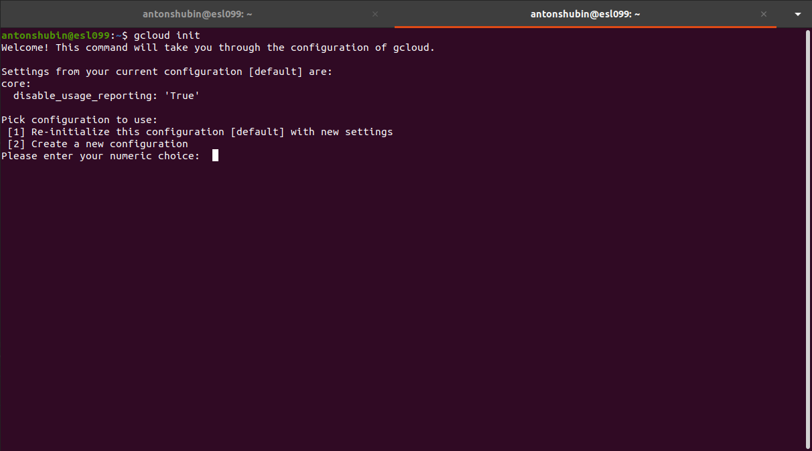

# GKE-Deployment-Tutorial

Данный туториал нацелен помочь новичкам развернуть свое приложение с использованием технологий Kubernetes и GKE(Google
Kubernetes Engine).

> #### Перед началом прохождения настоятельно рекомендую пройти [Kubernetes-WorkStart-GUIDE](https://github.com/DarkReduX/Kubernetes-WorkStart-GUIDE/blob/master/README_RU.md "hover display"), т.к. именно от него отталкивается дальнейший туториал.

----

## Структура:

----
[Google Kubernetes Engine(GKE)](https://cloud.google.com/kubernetes-engine/docs/concepts/kubernetes-engine-overview#:~:text=Google%20Kubernetes%20Engine%20(GKE)%20provides,together%20to%20form%20a%20cluster.)
— мощная система управления и оркестровки для контейнеров Docker, действующих в облачном пространстве Google. Container
Engine составляет контейнеры в кластеры и управляет ими автоматически, опираясь на определенные вами требования.

----

## Подготовка к развертыванию

Для начала зайдем
на [Сайт](https://www.googleadservices.com/pagead/aclk?sa=L&ai=DChcSEwi85OS2vff0AhWFlLIKHQu3AFIYABAAGgJscg&ohost=www.google.com&cid=CAESQeD2Y18gJmJPL0wrTQAtXN7pCNWcCvV68U6iQXJngPHOD8c2bHqM9VyTj9a3W82dfI24mBP770ekSgEFm9R3aacO&sig=AOD64_2bkV2rgk28IwI8yfRU8DPMeCnJ7g&q&adurl&ved=2ahUKEwidrt62vff0AhVHmIsKHTZ-D64Q0Qx6BAgDEAE)
и нажмем на кнопку *Get started for free*. Перед нами появиться выбор создать новый аккаунт или зайти на уже
существующий.

После скачиваем google-cloud-sdk при помощи команды в терминале\
`snap install google-cloud-sdk`.

После установки вводим команду \
`gcloud init`\
Если вы все сделали правильно вы увидите следующее сообщение:\

Пока не будем изменять настройки, и выберем пункт 1:\
После нам предложат зайти на аккаунт google, если мы этого не сделали, либо выбрать уже авторизованный.

Теперь необходимо выбрать проект с которым мы будем работать, либо создать новый.\
В моем случае я создам новый проект.

Если мы зайдем на сайт и выберем раздел Select a project, то увидим наш только-что созданный проект *gke-deployment-tutorial*.

Теперь выберем default compute zone, выбор велик ;)

После выбора выведется сообщение о том что конфигурация завершена и проект готов к использованию.

Теперь создадим кластер *new-cluster*, в котором будут лежать наши сервисы, при помощи команды\
`gcloud container clusters create <имя кластера>`

Создаем новый config файл для kubernetes \
`gcloud container clusters get-credentials <имя кластера>`

Для проверки используем команду \
`kubectl config current-context` \
Должно отобразиться имя вашего кластера.

----
## Развертывание

Создадим docker image для каждого проекта при помощи команды \
`docker build <путь к Dockerfile> --tag <название образа>`

Далее необходимо отправить наши образы на GCR(Google Container Registry) где они будут храниться удаленно \
Для этого создадим копии образов со специфическим названием `docker tag <название образа> <регион>/<id кластера>/<название образа>` \
После воспользуемся командой `docker push <регион>/<id кластера>/<название образа>`

>Важно заметить что при использовании GCR нам придется указать image в deployment.yaml с таким же специфическим названием, к примеру image: "gcr.io/oceanic-impact-335410/microservice-app-name-service:latest"

Наши образы появятся в разделе *Container registry*

Теперь создаем kubernetes deployments для вышеупомянутых образов \
Для этого воспользуемся готовыми конфигами из предыдущего туториала

После переходим в раздел *Workloads* и если мы сделали все правильно мы увидим статус OK для каждого нода

На этом этапе можно сказать что развертывание закончено и наши сервисы работают в изолированной среде на облаке, однако как получить к ним доступ из вне? \
Для этого на придется открыть порты для кластера, воспользуемся командой `kubectl get service <имя сервиса> --output yaml`  

В данном случае нас интересует поле *nodePort* у меня оно равно `- nodePort: 31192` \
После вводим команды для создания нового правила для firewall `gcloud compute firewall-rules create test-node-port     --allow tcp:<порт который мы получили выше>`

Готово!
Проверим, отвечает ли сервис нашим запросам

Для этого узнаем ip `kubectl get nodes --output wide`

В данном случае нас интересует *EXTERNAL-IP* 

Возьмем первый и сделаем по нему запрос

Как видим мы получили response от сервиса который заменил все символы нижнего регистра на символы верхнего.

Кликай [сюда](https://github.com/INEFFABLE-games/gke-deployment-GitOps/blob/master/README_RU.md) если хочешь узнать как подгружать образы напрямую из github!
