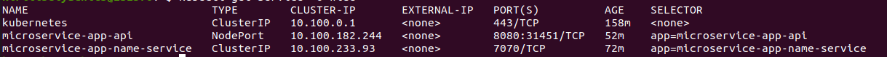
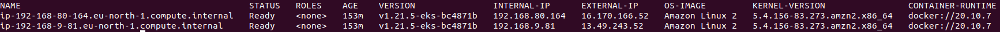
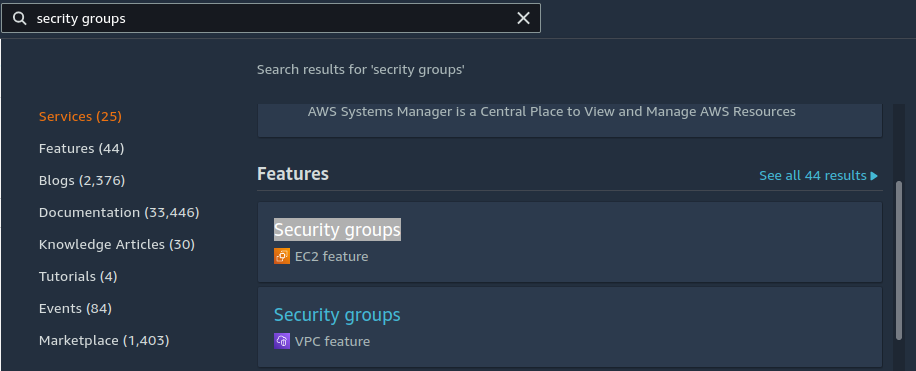
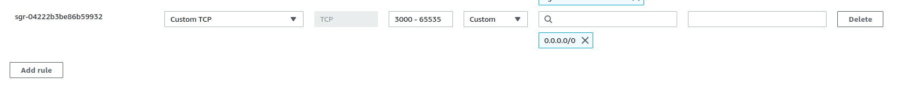

# Kubernetes-WorkStart-GUIDE

**Kubernetes** - Открытое программное обеспечение для оркестровки контейнеризированных приложений - автоматизации их развёртывания, масштабирования и координации в условиях кластера. Поддерживает основные технологии контейнеризации, включая Docker, rkt, также возможна поддержка технологий аппаратной виртуализации.

## Структура

1. [Концепции Kubernetes](#Концепции-Kubernetes)
2. [Deploy приложения в Kubernetes](#deploy-приложения-в-kubernetes-с-использованием-minikube)
   - [Deploy простого приложения](#Развертывание-простого-приложения)
   - [Deploy приложения с БД PostgreSQL](#Deploy-приложения-с-БД-PostgreSQL)
   - [Deploy микросервисного приложения](#Deploy-микросервисного-приложения)
3. [Deploy приложения на AWS EKS](#Deploy-приложения-на-AWS-EKS)
4. [Deploy приложения на Google Kubernetes Cloud](#Deploy-приложения-на-Google-Kubernetes-Cloud)
5. [GitOps](#GitOps)
   - [GitOps с AWS EKS](#GitOps-с-AWS-EKS)
   - [GitOps с GKE](#GitOps-с-GKE)
## Концепции Kubernetes

Nodes: Нода это машина в кластере Kubernetes.

Pods: Pod это группа контейнеров с общими разделами, запускаемых как единое целое.

Replication Controllers: replication controller гарантирует, что определенное количество «реплик» pod'ы будут запущены в любой момент времени.

Services: Сервис в Kubernetes это абстракция которая определяет логический объединённый набор pod и политику доступа к ним.

Volumes: Volume(раздел) это директория, возможно, с данными в ней, которая доступна в контейнере.

Labels: Label'ы это пары ключ/значение которые прикрепляются к объектам, например pod'ам. Label'ы могут быть использованы для создания и выбора наборов объектов.

Kubectl Command Line Interface: kubectl интерфейс командной строки для управления Kubernetes.

## Deploy приложения в Kubernetes с использованием Minikube
### Развертывание простого приложения

Для примера используется [простой http-server](https://github.com/DarkReduX/Kubernetes-WorkStart-GUIDE/tree/master/examples/simple-http-server) принимающий запрос GET : addres?name=Value и возвращающий ответ `Hello, <name>`

```go
package main

import (
	"fmt"
	"github.com/labstack/echo"
	"net/http"
)

func main() {
	e := echo.New()
	e.GET("/", func(c echo.Context) error {
		return c.String(http.StatusOK, fmt.Sprintf("Hello, %s", c.QueryParam("name")))
	})

	e.Logger.Fatal(e.Start(":8080"))
}
```

#### Шаг 1: создать docker image приложения

Необходимо описать инструкцию сборки образа docker. Для приложения выше использует Dockerfile:

```dockerfile
FROM golang:1.17.4-alpine

RUN mkdir /http-server

COPY . /http-server

WORKDIR /http-server

RUN go build -o main

CMD ["/http-server/main"]

EXPOSE 8080
```

Создание образа:
```shell
docker build . -t minikube-simple-app
```

#### Шаг 2. Запуск Minikube

Необходим установленный minikube

```shell
minikube start
kubectl config set-context minikube
```

Также перед запуском каких-либо команд Docker нужно задать окружение. Аналогично запуску eval $(docker-machine env), мы создаем переменные окружения Docker для Minikube с помощью команды minikube docker-env:

```shell
eval $(minikube docker-env)
```

#### Шаг 3. Создание Deployment'a и Service'a в кластере Kubernetes

Deployment - Развертывание предоставляет декларативные обновления для модулей и наборов реплик.

Вы описываете желаемое состояние в развертывании, и контроллер развертывания изменяет фактическое состояние на желаемое состояние с контролируемой скоростью. Вы можете определить развертывания для создания новых наборов реплик или для удаления существующих развертываний и использования всех их ресурсов в новых развертываниях.

app-deployment.yml:
```yaml
apiVersion: apps/v1
kind: Deployment
metadata:
  name: minikube-simple-app
  labels:
    app: minikube-simple-app
spec:
  selector:
    matchLabels:
      app: minikube-simple-app
  template:
    metadata:
      labels:
        app: minikube-simple-app
    spec:
      containers:
        - name: minikube-simple-app
          image: "minikube-simple-app:latest"
          imagePullPolicy: IfNotPresent
```

Раздел selector - представляет инструкцию(конфигурацию) для абстракции уровня Deployment для поиска pod'ов b replica-sets которыми он управляет и в случает их отказа восстанавливает

Раздел template - представляет инструкцию(конфигурацию) для создания pod'ов и replica-sets по определенному в yaml шаблону

Соответственно метки в разделе selector должны соответствовать меткам описаным в разделе template.

app-service.yml:
```yaml
apiVersion: v1
kind: Service
metadata:
  name: minikube-simple-app
  labels:
    app: minikube-simple-app
spec:
  type: NodePort
  ports:
    - port: 8080
      protocol: TCP
      targetPort: 8080
      nodePort: 30080
  selector:
    app: minikube-simple-app
```

Для создания Deployment и Service из файлов yaml в лежащих в текущей директории используется:
```shell
kubectl apply -f . 
```

Или

```shell
kubectl apply -f ./app-deployment.yml
kubectl apply -f ./app-service.yml
```

Посмотреть состояние сервисов, деплоев и подов можно используя

```shell
# информация о всех ресурсах в кластере
kubectl get all
# или выборка информации о ресурсах
kubectl get pod,deployment,service,rs 
```

Также можно использовать UI Kubernetes

```shell
minikube dashboard
```


Чтобы получить адрес сервиса используйте:
```shell
minikube service minikube-simple-app --url
```

Или

```shell
minikube service minikube-simple-app
```

По итогу получим ответ с сервера:


### Deploy приложения с БД PostgreSQL

Перед началом ознакомьтесь с [Stateful Applications Kubernetes](https://kubernetes.io/docs/tutorials/stateful-application/), а также [K8s: Deployments vs StatefulSets vs DaemonSets](https://medium.com/stakater/k8s-deployments-vs-statefulsets-vs-daemonsets-60582f0c62d4)

Например у нас имеется [приложение с CRUD'ом](https://github.com/DarkReduX/Kubernetes-WorkStart-GUIDE/tree/master/examples/CRUD-app)  и вместе с ним задеплоить базу данных, к которой оно будет подключаться

Деплой приложения происходит также как и в прошлой части.

Для начала создадим StatefulSet для PostgreSQL. Т.к нам необходим пароль для подключения создадим Secret:

В secret'ах данные находятся в кодировке base64, чтобы получить кодировку в командной строке выполним:

```shell
echo postgres-password | base64
# Output: cG9zdGdyZXMtcGFzc3dvcmQK
```

postgres-secrets.yml:

```yaml
apiVersion: v1
kind: Secret
metadata:
  name: postgres-secret-config
type: Opaque
data:
  password: cG9zdGdyZXMtcGFzc3dvcmQK
```

Далее необходимо создать StatefulSet Application.

postgres-deployment.yml:

```yaml
apiVersion: apps/v1
kind: StatefulSet
metadata:
  name: postgres-database
spec:
  selector:
    matchLabels:
      app: postgres-database
  serviceName: postgres-service
  replicas: 1
  template:
    metadata:
      labels:
        app: postgres-database
    spec:
      containers:
        - name: postgres-database
          image: postgres
          volumeMounts:
            - name: postgres-disk
              mountPath: /var/lib/postgresql/data
          env:
            - name: POSTGRES_PASSWORD
              valueFrom:
                secretKeyRef:
                  name: postgres-secret-config
                  key: password
            - name: PGDATA
              value: /var/lib/postgresql/data/pgdata
  volumeClaimTemplates:
    - metadata:
        name: postgres-disk
      spec:
        accessModes: ["ReadWriteOnce"]
        resources:
          requests:
            storage: 10Gi
```

Можно заметить что для настройки переменных среды, а также чтобы получить пароль базы данных из Secret и передать в переменные среды Pod'a используется следующая структура:
```yaml
#.................................................
         env:
            - name: POSTGRES_PASSWORD
              valueFrom:
                 secretKeyRef:
                    name: postgres-secret-config
                    key: password
            - name: PGDATA
              value: /var/lib/postgresql/data/pgdata
#.....................................................
```

postgres-service.yml:

```yaml
apiVersion: v1
kind: Service
metadata:
  name: postgres-service
spec:
  selector:
    app: postgres-database
  type: NodePort
  ports:
    - port: 5432
      targetPort: 5432
```

Наше приложение из примера для подключения к базе данных использует данные из переменных среды
```go
// =============config=============
package config

import (
"github.com/caarlos0/env"
log "github.com/sirupsen/logrus"
)

type PostgresConfig struct {
   Host     string `env:"POSTGRES_HOST,required"`
   PORT     string `env:"POSTGRES_PORT,required"`
   Password string `env:"POSTGRES_PASSWORD,required"`
   User     string `env:"POSTGRES_USER,required"`
   DbName   string `env:"POSTGRES_DBNAME,required"`
}

func NewPostgresConfig() *PostgresConfig {
   cfg := &PostgresConfig{}
   if err := env.Parse(cfg); err != nil {
      log.Fatalf("Couldn't parse postgres config: %v", err)
      return nil
   }

   return cfg
}

//==========main===========

package main

func main() {
    postgresConfig := config.NewPostgresConfig()
    //....
}
```

В данном случае yaml-файл будет похож на тот что использовался при деплое прошлого приложения, но будут пробрасываться переменные среды.

app-deploy.yml:

```yaml
apiVersion: apps/v1
kind: Deployment
metadata:
  name: minikube-crud-app
  labels:
    app: minikube-crud-app
spec:
  selector:
    matchLabels:
      app: minikube-crud-app
  template:
    metadata:
      labels:
        app: minikube-crud-app
    spec:
      containers:
        - name: minikube-crud-app
          image: "minikube-crud-app:latest"
          env:
            - name: POSTGRES_PASSWORD
              valueFrom:
                secretKeyRef:
                    name: postgres-secret-config
                    key: password
            - name: POSTGRES_PORT
              value: '5432'
            - name: POSTGRES_USER
              value: postgres
            - name: POSTGRES_DBNAME
              value: postgres
              # для получения адреса сервиса
              # внутри кластера используется структура
              # <service-name>.<namespace>.svc.cluster.local
            - name: POSTGRES_HOST
              value: postgres-service.default.svc.cluster.local
          imagePullPolicy: IfNotPresent
```


app-service.yml:

```yaml
apiVersion: v1
kind: Service
metadata:
  name: minikube-crud-app
  labels:
    app: minikube-crud-app
spec:
  type: NodePort
  ports:
    - port: 8080
      protocol: TCP
      targetPort: 8080
      # nodePort можно не указывать, тогда он будет сгенерирован кластером
      nodePort: 30081
  selector:
    app: minikube-crud-app
```

## Deploy микросервисного приложения

Допустим у нас имеется [API](https://github.com/DarkReduX/Kubernetes-WorkStart-GUIDE/tree/master/examples/microservice-app/api), который принимает GET запрос http://host:port?name=andrey с параметром `name = andrey`, отправляет запрос на сервис который преобразует все символы в верхний регистр и возвращает пользователю.

Соответственно необходимо пробросить внешний порт для API, а name-service будет работать во внутренней сети кластера. Сервисы в Kubernetes бывают 4-х типов c которыми можно ознакомиться здесь: https://kubernetes.io/docs/concepts/services-networking/service/#publishing-services-service-types

Также необходимо создать Docker Image для API и Name-Service

### Name-Service deploy

Следующие команды выполняются из корня проекта  Name-Service:

```shell
eval $(minikube docker-env)
docker build . -t microservice-app-name-service
```

app-deployment.yml :
```yaml
apiVersion: apps/v1
kind: Deployment
metadata:
   name: microservice-app-name-service
   labels:
      app: microservice-app-name-service
spec:
   selector:
      matchLabels:
         app: microservice-app-name-service
   template:
      metadata:
         labels:
            app: microservice-app-name-service
      spec:
         containers:
            - name: microservice-app-name-service
              image: "microservice-app-name-service:latest"
              env:
                 # Т.к необходимо чтобы сервис слушал входящие запросы с API
                 # задаем адрес API используя конструкцию <service-name>.<namespace>.svc.cluster.local
                 - name: NAME_LISTEN_HOST
                   value: 'microservice-app-api.default.svc.cluster.local'
                 - name: NAME_PORT
                   value: '7070'
              imagePullPolicy: IfNotPresent
```

app-service.yml :
```yaml
apiVersion: v1
kind: Service
metadata:
   name: microservice-app-name-service
   labels:
      app: microservice-app-name-service
spec:
   type: ClusterIP
   ports:
      - port: 7070
        protocol: TCP
   selector:
      app: microservice-app-name-service
```


### API deploy


Следующие команды выполняются из корня проекта  api:

```shell
# если до этого исполняли 'eval $(minikube docker-env)', повторно использовать нет необходимости
eval $(minikube docker-env) 

docker build . -t microservice-app-api
```

app-deployment.yml :
```yaml
apiVersion: apps/v1
kind: Deployment
metadata:
   name: microservice-app-api
   labels:
      app: microservice-app-api
spec:
   selector:
      matchLabels:
         app: microservice-app-api
   template:
      metadata:
         labels:
            app: microservice-app-api
      spec:
         containers:
            - name: microservice-app-api
              image: "microservice-app-api:latest"
              env:
                 - name: NAME_HOST
                   value: 'microservice-app-name-service.default.svc.cluster.local'
                 - name: NAME_PORT
                   value: '7070'
              imagePullPolicy: IfNotPresent
```

app-service.yml :
```yaml
apiVersion: v1
kind: Service
metadata:
   name: microservice-app-api
   labels:
      app: microservice-app-api
spec:
   # тип NodePort используется чтобы открыть доступ к сервису из вне кластера
   type: NodePort
   ports:
      - port: 8080
        protocol: TCP
        targetPort: 8080
   selector:
      app: microservice-app-api
```

## Deploy приложения на AWS EKS

### Создание кластера на AWS EKS
Перед началом работы необходим утсановленный и сконфигурированный [AWS CLI](https://aws.amazon.com/ru/cli/), а также установить [eksctl command line utility](https://docs.aws.amazon.com/eks/latest/userguide/eksctl.html)

Для начала необходимо создать кластер в EKS:

```shell
eksctl --name test-learn-eks --region eu-north-1
```
eksctl создаст самостоятельно kubectl config файл в ~/.kube или добавит конфигурацию нового кластера в существующий конфиг на вашем компьютере

Чтобы посмотреть существующие Node'ы используйте

```shell
kubectl get nodes -o wide
#Output
# NAME                                            STATUS   ROLES    AGE     VERSION               INTERNAL-IP      EXTERNAL-IP     OS-IMAGE         KERNEL-VERSION                CONTAINER-RUNTIME
# ip-<IP>.eu-north-1.compute.internal             Ready    <none>   8m35s   v1.21.5-eks-bc4871b   IP               IP              Amazon Linux 2   5.4.156-83.273.amzn2.x86_64   docker://20.10.7
# ip-<IP>.eu-north-1.compute.internal             Ready    <none>   9m6s    v1.21.5-eks-bc4871b   IP               IP              Amazon Linux 2   5.4.156-83.273.amzn2.x86_64   docker://20.10.7
```

Чтобы посмотреть Pod'ы, которые запущены на вашем Cluster'e используйте:
```shell
kubectl get pods --all-namespaces -o wide
# Output
# NAMESPACE     NAME                       READY   STATUS    RESTARTS   AGE   IP               NODE                                            NOMINATED NODE   READINESS GATES
# kube-system   aws-node-wfqw4             1/1     Running   0          11m   <IP>             ip-<IP>.eu-north-1.compute.internal             <none>           <none>
# kube-system   aws-node-x9hbf             1/1     Running   0          10m   <IP>             ip-<IP>.eu-north-1.compute.internal             <none>           <none>
# kube-system   coredns-5bf7669654-89tcx   1/1     Running   0          19m   <IP>             ip-<IP>.eu-north-1.compute.internal             <none>           <none>
# kube-system   coredns-5bf7669654-kbcxt   1/1     Running   0          19m   <IP>             ip-<IP>.eu-north-1.compute.internal             <none>           <none>
# kube-system   kube-proxy-fqwfk           1/1     Running   0          10m   <IP>             ip-<IP>.eu-north-1.compute.internal             <none>           <none>
# kube-system   kube-proxy-kkrks           1/1     Running   0          11m   <IP>             ip-<IP>.eu-north-1.compute.internal             <none>           <none>
```

### Deploy микросервисного приложения на AWS EKS

Развертывать будем [приложение из последнего примера](./examples/microservice-app):

Чтобы EKS мог использовать наши docker images их необходимо запушить либо в AWS ECR ([guide](https://docs.aws.amazon.com/eks/latest/userguide/private-clusters.html#container-images)), либо на DockerHub, в данном примере будет использоваться DockerHub.

Предварительно необходимо авторизоваться в DockerHub

```shell
docker login
```

Также перед тем как опубликовать наши Docker Images необходимо изменить им имя:
```shell
docker tag microservice-app-name-service:latest <DOCKER_ID>/microservice-app-name-service:latest
docker tag microservice-app-api:latest <DOCKER_ID>/microservice-app-api:latest
```

Для того чтобы залить их на DockerHub необходимо создать репозитории с именнем image'ей без DOCKER_ID (пример: microservice-app-api) выполнить:
```shell
docker push <DOCKER_ID>/microservice-app-name-service:latest
docker push <DOCKER_ID>/microservice-app-api:latest
```

После чего в app-deployment.yml обоих проектов необходимо изменить:
```yaml
#=== Not changed ====
    spec:
      containers:
        - name: microservice-app-api
          image: "microservice-app-api:latest"
#=== Changed ===
    spec:
       containers:
          - name: microservice-app-api
            image: "<DOCKER_ID>/microservice-app-api:latest"
```

И для развертывания приложений используем рекурсивный обход (-R):
```shell
cd ./Kubernetes-WorkStart-GUIDE/examples/microservice-app

kubectl apply -R -f .
```

При этом мы не сможем получить доступ к сервису API с типом NodePort
```shell
kubectl get service -o wide
```


Так как порт пробрасывается на WorkerNodes, к которым с SercurityGroup rules по умолчанию у нас не будет доступа

```shell
kubectl get nodes -o wide
```



При попытке обратиться к нашему API по адресам, не будет подключения:
- 16.170.166.52:31451
- 13.49.243.52:31451

Для этого перейдем в Консоль Управления AWS и далее перейдем в Security Groups


Выберем группу кластера


И добавим такое правило:



После чего при запросах:
- 16.170.166.52:31451?name=aws_eks_deployment
- 13.49.243.52:31451?name=aws_eks_deployment

Получим такое сообщение:

AWS_EKS_DEPLOYMENT

## GitOps

### GitOps с AWS EKS

#### Создание ECR container registry и установка GitOps Actions Workflow

Здесь будет описано как добавить GitOps deployment с использованием Flux и Github Acitons. В данном примере исользуется [просто приложение](./examples/simple-http-server) из первого примера.

В таблице перечислены все необходимые инструменты.


|         Component         	| Implementation                        	                                                 | Notes                                                                                                                               	|
|:-------------------------:	|-----------------------------------------------------------------------------------------|-------------------------------------------------------------------------------------------------------------------------------------	|
| EKS                       	| [EKSctl](https://eksctl.io/)                                	                           | Managed Kubernetes service.                                                                                                         	|
| Git repo                  	| https://github.com/DarkReduX/ci-cd-eks 	                                                                                      | A Git repository containing your application and cluster manifests files.                                                           	|
| Continuous Integration    	| [GitHub Actions](https://github.com/features/actions)                        	          | Test and integrate the code - can be anything from CircleCI to GitHub actions.                                                      	|
| Continuous Delivery       	| [Flux version 2](https://toolkit.fluxcd.io/cmd/flux/)                                  	 | Cluster <-> repo synchronization                                                                                                    	|
| Container Registry        	| [AWS ECR Container Registry](https://aws.amazon.com/ecr/)            	                  | Can be any image registry or even a directory.                                                                                      	|
| GitHub secrets management 	| ECR                                   	                                                 | Can use [Sealed Secrets](https://github.com/bitnami-labs/sealed-secrets) or [Vault](https://www.vaultproject.io/).In this case we are using Elastic Container Registry (ECR) which provides resource level  security. 	|

Создание Cluster'a:
```shell
 eksctl create cluster --name test --node-type=t3.small --nodes-max=1 --nodes-min=1
```
В этом разделе вы настроите реестр ECR и мини-конвейер CI с помощью действий GitHub. Действия создают новый контейнер на "git push", помечают его git-sha, а затем помещают его в реестр ECR. Он также обновляет и фиксирует изменение тега изображения в вашем файле kustomize. Как только новое изображение оказывается в хранилище, Flux замечает новое изображение и затем развертывает его в кластере. Весь этот поток станет более очевидным в следующем разделе после того, как вы настроите поток.


Также необходимо создать [ECR](https://aws.amazon.com/ru/ecr/) repository, в том же регионе, в котором был запущен кластер, В данном примере используется репозиторий с именем "test".


Установить в репозитории GitHub Secrets: 
```yaml
AWS_ACCOUNT_ID

AWS_ACCESS_KEY_ID

AWS_SECRET_ACCESS_KEY
```

Также проверьте в репозитории .github/workflows/main.yml. Убедитесь, что переменные среды в строках 16-20 main.yml настроены правильно.
```yaml
16 AWS_DEFAULT_REGION: eu-west-1

17 AWS_DEFAULT_OUTPUT: json

18 AWS_ACCOUNT_ID: ${{ secrets.AWS_ACCOUNT_ID }}

19 AWS_ACCESS_KEY_ID: ${{ secrets.AWS_ACCESS_KEY_ID }}

20 AWS_SECRET_ACCESS_KEY: ${{ secrets.AWS_SECRET_ACCESS_KEY }}
```

AWS_DEFAULT_REGION - регион в котором расположен ваш кластер.

#### Установка Flux

Для установки посмотрите: [Installing the Flux CLI](https://fluxcd.io/docs/get-started/#install-the-flux-cli).

После установки убедитесь, что ваш кластер EKS удовлетворяет необходимым требованиям:
```shell
flux check --pre
```

Если всё прошло успешно вывод будет похож на этот:

```shell
► checking prerequisites

✔ kubectl 1.19.3 >=1.18.0

✔ Kubernetes 1.17.9-eks-a84824 >=1.16.0

✔ prerequisites checks passed
```

Flux поддерживает синхронизацию манифестов в одном каталоге, но когда у вас много YAML, более эффективно использовать Kustomize для управления ими. В примере все манифесты были скопированы в каталог развертывания и добавлен файл Kustomize. В этом примере файл kustomize содержит директиву `Newtag`  image'a манифеста развертывания:

```yaml
images:

- name: ci-cd-eks
  newName: test
  newTag: new
```

#### Установка flux и других controller'ов в  cluster

Экспортируйте в переменные среды Github Personal Access Token и имя пользователя

```shell
export GITHUB_TOKEN=[your-github-token]

export GITHUB_USER=[your-github-username]
```

#### Создание Flux Reconciliation Repository

На этом этапе создается частное хранилище, и все контроллеры также будут установлены в вашем кластере EKS. При начальной загрузке репозитория с помощью Flux также можно применить только подкаталог в репозитории и, следовательно, подключиться к нескольким кластерам или местоположениям, к которым можно применить конфигурацию. Чтобы упростить задачу, в этом примере в качестве пути применения задается имя одного кластера:

```shell
flux bootstrap github \

  --owner=$GITHUB_USER \

  --repository=fleet-infra \

  --branch=main \

  --path=[cluster-name] \

  --personal
```

Flux версии 2 позволяет легко работать с несколькими кластерами и несколькими репозиториями. Новые конфигурации кластера и приложения можно применять из одного и того же репозитория, указав новый путь для каждого.

Как только он завершит загрузку, вы увидите следующее:

```shell
► connecting to github.com

✔ repository cloned

✚ generating manifests

✔ components manifests pushed

► installing components in flux-system namespace …..

deployment "source-controller" successfully rolled out

deployment "kustomize-controller" successfully rolled out

deployment "helm-controller" successfully rolled out

deployment "notification-controller" successfully rolled out
```

Проверьте кластер имеется ли namespace flux-system:

```shell
kubectl get namespaces

NAME              STATUS   AGE

default           Active   5h25m

flux-system       Active   5h13m

kube-node-lease   Active   5h25m

kube-public       Active   5h25m

kube-system       Active   5h25m
```

Загрузите и переместитесь в созданный приватный репозиторий fleet-infra

```shell
git clone https://github.com/$GITHUB_USER/fleet-infra
cd fleet-infra
```

Подключение ci-cd-eks репозитория к fleet-infra:

```shell
flux create source git [ci-cd-eks] \

  --url=https://github.com/[github-user-id/ci-cd-eks] \

  --branch=master \

  --interval=30s \

  --export > ./[cluster-name]/[ci-cd-eks]-source.yaml
```

Где
- [ci-cd-eks] is the name of your app or service

- [cluster-name] is the cluster name

- [github-user-id/ci-cd-eks] is the forked ci-cd-eks repository

Также необходимо настроить Flux Kustomization для того чтобы принимать изменения из ./deploy
```shell
flux create kustomization ci-cd-eks \

 --source=ci-cd-eks \

 --path="./deploy" \

 --prune=true \

 --interval=1h \

 --export > ./[cluster-name]/ci-cd-eks-sync.yaml
```

Закоммитьте и запушьте изменения в репозиторий

```shell
git add -A && git commit -m "add ci-cd-eks deploy" && git push

watch flux get kustomizations
```

Теперь вы должны увидеть последние версии компонентов flux toolkit, а также исходный код ci-cd-eks, извлеченный и развернутый в вашем кластере:

```shell
NAME            READY   MESSAGE                                                                 REVISION                                        SUSPENDED
ci-cd-eks       True    Applied revision: master/ecfa7e3b8dd30b19f9213e7930949329b128e344       master/ecfa7e3b8dd30b19f9213e7930949329b128e344 False
flux-system     True    Applied revision: main/9b6d555187f7cc090ff315475798b7f76c099aa0         main/9b6d555187f7cc090ff315475798b7f76c099aa0   False
```

Проверим запущен ли контейнер в кластере ci-cd-eks
```shell
kubectl get pods 

NAME                                         STATUS   ROLES    AGE   VERSION               INTERNAL-IP    EXTERNAL-IP     OS-IMAGE         KERNEL-VERSION                CONTAINER-RUNTIME
ip-192-168-45-2.us-west-2.compute.internal   Ready    <none>   23m   v1.21.5-eks-bc4871b   192.168.45.2   34.213.137.53   Amazon Linux 2   5.4.156-83.273.amzn2.x86_64   docker://20.10.7
```

Теперь давайте проверим deploy через `git push`

Добавим лог в main.go:

```go
package main

import (
   "fmt"
   "github.com/labstack/echo"
   "github.com/sirupsen/logrus"
   "net/http"
)

func main() {
   // ====== Здесь добавили лог =====
   logrus.Info("run app")
   // ===============================
   e := echo.New()
   e.GET("/", func(c echo.Context) error {
      return c.String(http.StatusOK, fmt.Sprintf("Hello, %s", c.QueryParam("name")))
   })

   e.Logger.Fatal(e.Start(":8080"))
}
```

И проверим логи в pod'e:

```shell
kubect get pods
# Output
# NAME                                  READY   STATUS    RESTARTS   AGE
# minikube-simple-app-955978c7c-dqr6c   1/1     Running   0          13s

kubect logs minikube-simple-app-955978c7c-dqr6c
```

И получим такое сообщение:

```shell
   ____    __
  / __/___/ /  ___
 / _// __/ _ \/ _ \
/___/\__/_//_/\___/ v3.3.10-dev
High performance, minimalist Go web framework
https://echo.labstack.com
____________________________________O/_______
                                    O\
⇨ http server started on [::]:8080
time="2021-12-27T15:25:24Z" level=info msg="run app"
```

## Дополнительные Ресурсы:

- [Kubernetes Concepts](https://kubernetes.io/docs/concepts/)
- [Kubernetes Docs](https://kubernetes.io/docs/home/)
- [Amazon EKS](https://docs.aws.amazon.com/eks/latest/userguide/getting-started-eksctl.html)
- https://faun.pub/learning-kubernetes-by-doing-part-3-services-ed5bf7e2bc8e